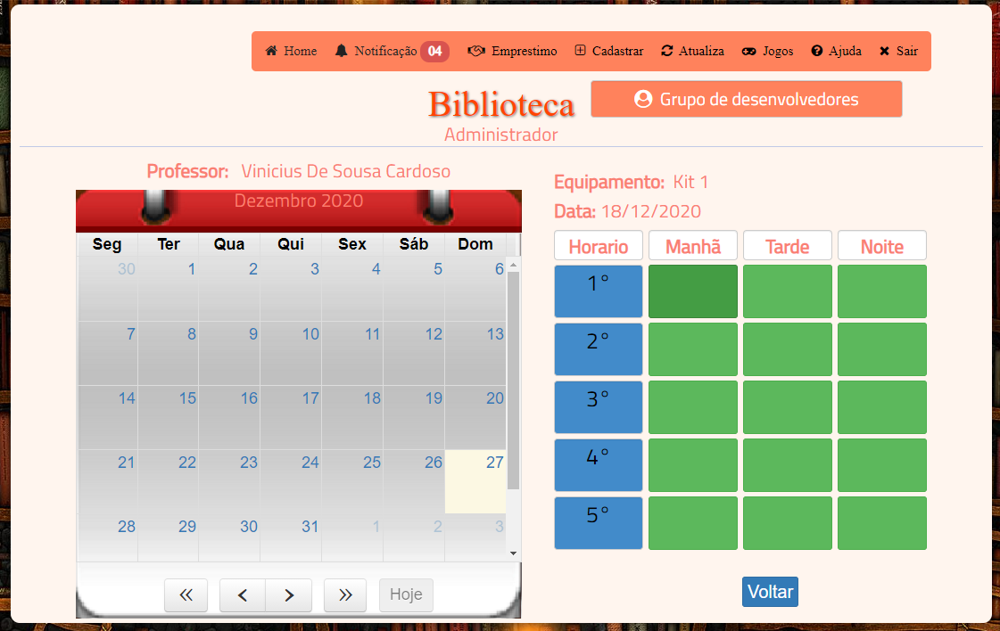
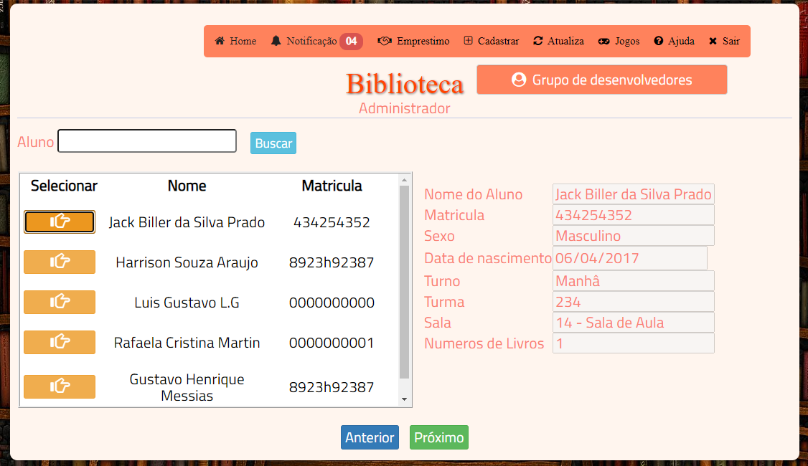
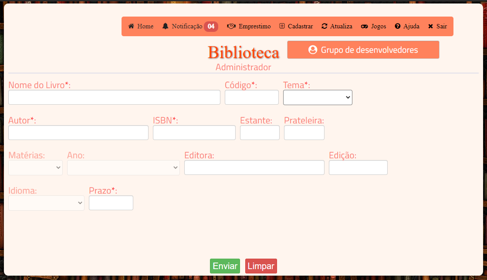
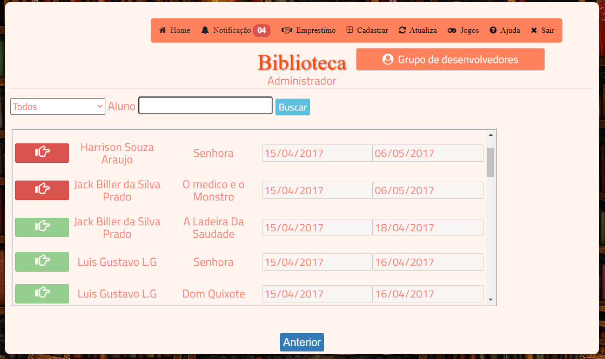

## Sistema de Biblioteca

Projeto de Conclusão do curso técnico de informática, objetivo realizar cadastros de alunos e livros e controlar o emprestimo de livros e agendamento de uso dos equipamentos da escola

O projeto serviu como base para entender como funcionava o desenvolvimento de um sistema de gestão, ele possui formularios de cadastros, movimentações de emprestimo e agendamento, sistema de notificação dos emprestimos em atraso.

### Tecnologias Utilizadas
- HTML, CSS e JavaScript
- jQuery
- Bootstrap 3
- PHP
- MySQL

### Fotos

